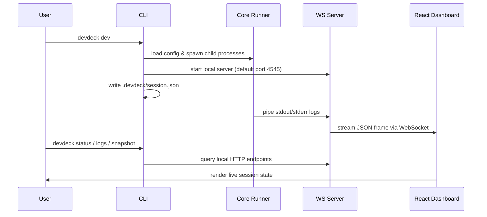

# DevDeck Architecture

DevDeck is designed to be lightweight, local-first, and useful to both humans and agents. The same running session serves a browser dashboard and a bounded CLI control surface.

---

## 1. Monorepo Structure

DevDeck is organized as a multi-package npm workspace:

```txt
dev-deck/
├── apps/
│   └── dashboard/          # Next.js static-exported React dashboard
└── packages/
    ├── cli/                # Command line entry points (init, dev, agent, status, logs)
    ├── config/             # YAML parsing, validation, and error types
    ├── core/               # Process runner, ring buffer log parser, session context
    └── server/             # Express HTTP router, WebSocket live log broker
```

---

## 2. Component Layers

### CLI Package (`@devdeck/cli`)
The CLI is the main package both humans and local agents execute. It handles:
- Config bootstrap with `devdeck init`
- Foreground session startup with `devdeck dev`
- Runtime session discovery through `.devdeck/session.json`
- Agent-facing status, logs, snapshot, and service control commands

### Config Package (`@devdeck/config`)
Responsible for finding, reading, parsing, and validating `devdeck.yml`. It ensures service paths exist and checks for configuration duplicates or malformed fields, throwing descriptive user-facing warnings on failure.

### Core Package (`@devdeck/core`)
The engine of the service runner:
- **Process Runner:** Spawns native Node `child_process` commands. Captures stdout/stderr, and hooks process exit/crash states.
- **Log Buffer:** Maintains a high-speed, bounded in-memory circular (ring) buffer (defaults to 1000 lines) of service outputs. This avoids disk writes and database dependencies.
- **Log Classification:** Identifies severity levels (`ERROR`, `WARN`, `INFO`) based on common logs string patterns.
- **Debug Context:** Structures a complete diagnostic snapshot (status, active ports, crash codes, surrounding logs) format ready to be copied.

### Server Package (`@devdeck/server`)
A fast, lightweight Node HTTP server that:
- Hosts the compiled, statically exported React frontend assets.
- Serves HTTP endpoints for `snapshot`, `logs`, `export`, and start/stop/restart actions.
- Hosts a WebSocket server to stream real-time JSON log frames to active browser clients.

### Dashboard App (`@devdeck/dashboard`)
A responsive, high-performance web dashboard built with React, Framer Motion, and Tailwind CSS. It features:
- **Interactive Grid:** Drag-and-drop tiles to resize and move logs lanes.
- **Flexible Themes:** Five custom card colors with glowing interactive borders to help separate logs visually.
- **One-Click Handoff:** Copies raw markdown log bundles directly to clipboard for AI agent prompts or issue reports.
- **State Persistence:** Preserves active workspace configuration layouts in the browser's `localStorage` per project.

---

## 3. Communication Workflow

The diagram below details the real-time event pipeline:



---

## 4. Resource Allocation & Bounded Limits

DevDeck runs entirely on your local machine with minimal CPU and RAM overhead:
- **In-Memory Buffering:** DevDeck stores a bounded recent log buffer in memory and discards older lines.
- **TCP Health Polling:** Port health checks run on a lightweight periodic timer to avoid network socket exhaustion.
- **Orphan Process Prevention:** On CLI shutdown, DevDeck executes a tree-kill clean-up to ensure background processes started by DevDeck do not remain as zombie processes.
