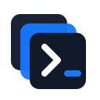

<p align="center">
  
</p>

<h1 align="center">DevDeck</h1>

<p align="center">
  <strong>The local runtime control plane for AI coding agents.</strong>
</p>

<p align="center">
  <a href="#install">Install</a>
  ·
  <a href="#60-second-quick-start">Quick Start</a>
  ·
  <a href="Docs/README.md">Docs</a>
  ·
  <a href="CONTRIBUTING.md">Contributing</a>
</p>

Agents are great at code.
They are terrible at babysitting terminals.

DevDeck gives agents one bounded CLI to start, stop, inspect, debug, and snapshot local multi-service stacks without flooding model context with raw terminal noise.

## Why DevDeck Exists

Modern local development stacks rarely fit in one terminal. Frontends, APIs, workers, queues, databases, and supporting services all need coordination, and that coordination gets noisy fast.

DevDeck reduces that noise. It gives humans and agents one runtime control plane for local stacks so they can:

- start everything from one config
- inspect machine-readable state
- fetch bounded logs instead of dumping full terminal buffers
- snapshot the current deck before escalating a debugging problem
- restart only the service that changed

## What DevDeck Is / Is Not

DevDeck is a local-first CLI for orchestrating and debugging multi-service development stacks.

DevDeck does not replace npm, Docker Compose, Turborepo, or your app framework.

It gives agents and humans a bounded control plane over those processes.

## Install

Install the published CLI package locally in your project:

```bash
npm install -D @hemangdoshi/devdeck
```

The package exposes the `devdeck` binary, so you run it with `npx devdeck`.

## 60-Second Quick Start

```bash
npm install -D @hemangdoshi/devdeck
npx devdeck init
npx devdeck start
npx devdeck status
```

Starter `devdeck.yml`:

```yaml
project: my-awesome-app
services:
  web:
    command: npm run dev
    cwd: ./frontend
    port: 3000
    group: frontend
  api:
    command: npm start
    cwd: ./backend
    port: 8080
    group: backend
```

Open `http://127.0.0.1:4545` to use the local dashboard.

## Agent-First Workflow

When an AI coding agent is operating in a repo that uses DevDeck, the default loop is:

1. Install the package if it is not already present.
2. Run `npx devdeck start` instead of starting raw long-running processes.
3. Use `npx devdeck status --agent` for compact diagnosis-oriented state.
4. Use `npx devdeck logs <service> --agent --tail 80` for bounded debugging context.
5. Run `npx devdeck snapshot --agent` before asking a human for extra diagnostics.
6. Switch to `--json` only when full structured state is required.
7. Stop the deck with `npx devdeck stop` when the task is complete.

This keeps runtime coordination out of sprawling terminal transcripts and inside a stable CLI contract.

## Human Workflow

For humans, DevDeck is the same control plane with a simpler mental model:

1. Define your services once in `devdeck.yml`.
2. Start the full stack with `npx devdeck start` or `npx devdeck dev`.
3. Inspect health with `npx devdeck status`.
4. Read bounded logs with `npx devdeck logs`.
5. Restart only what you need with `npx devdeck service restart <name>`.
6. Stop everything cleanly with `npx devdeck stop`.

## Core Commands

| Command | Purpose |
|---|---|
| `npx devdeck init` | Generate a starter `devdeck.yml` |
| `npx devdeck dev` | Start DevDeck in the foreground |
| `npx devdeck start` | Start DevDeck in the background |
| `npx devdeck status` | Inspect current service state |
| `npx devdeck status --agent` | Inspect compact agent-oriented state |
| `npx devdeck status --json` | Inspect machine-readable service state |
| `npx devdeck logs <service> --agent --tail 80` | Read compact evidence-oriented logs for one service |
| `npx devdeck snapshot --agent` | Capture a compact diagnosis packet |
| `npx devdeck service restart <name>` | Restart one service |
| `npx devdeck stop` | Stop the full deck |

## Example `devdeck.yml`

```yaml
project: my-microservices-app
services:
  frontend:
    command: npm run dev
    cwd: ./apps/frontend
    port: 5173
    group: frontend
  api:
    command: npm run dev
    cwd: ./apps/api
    port: 3000
    group: backend
  worker:
    command: npm run worker
    cwd: ./apps/api
    group: backend
```

## Token Savings Proof

DevDeck includes a reproducible benchmark harness under `benchmarks/`.

The first published report is available here:

`benchmarks/reports/v1.3.0-node-api-worker-v0/summary.md`

The first published report is a historical approximate-only result. Current local harness runs use named real tokenizers and scripted scenario evaluation. Results remain fixture-specific, and we do not claim universal savings.

DevDeck also includes an optional live-agent evaluation harness under `evals/live-agent/`. That harness compares the same scenario under raw shell and DevDeck-guided debugging, records transcript-token approximations, and records provider usage only when the runtime exposes it.

## Current Status: v1.4

DevDeck v1.4 ships the core OSS foundation:

- local CLI orchestration for multi-service stacks
- agent-friendly bounded inspection commands
- structured `DD-ERR-XXXX` diagnostics
- a local dashboard for visual monitoring and control

This slice focuses on productization, onboarding, and repository trust signals rather than runtime feature changes.

## Roadmap

- publish reproducible token-savings benchmarks
- deepen configuration and architecture docs
- expand launch assets and OSS examples
- refine agent contracts and non-interactive workflows

## Contributing

Start with [CONTRIBUTING.md](CONTRIBUTING.md), then read:

- [LLMs.md](LLMs.md) for the agent integration contract
- [HUMANs.md](HUMANs.md) for human onboarding
- [Docs/README.md](Docs/README.md) for deeper documentation
- [evals/README.md](evals/README.md) for optional live evaluation workflows

## License

Distributed under the MIT License. See [LICENSE](LICENSE).
