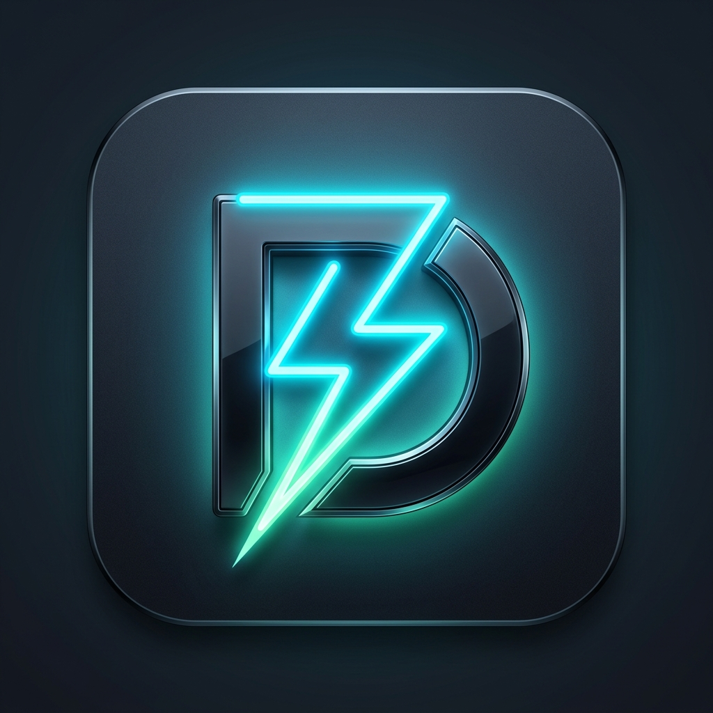

#  Agent DevDeck

[](https://opensource.org/licenses/MIT)
[](http://makeapullrequest.com)

**Agent DevDeck** is a local-first agent control plane for starting, stopping, inspecting, and debugging multi-service local stacks through a bounded CLI and optional web dashboard.

Instead of scattering local orchestration across shell history, terminal tabs, and ad hoc scripts, Agent DevDeck runs native process trees, exposes targeted session state and logs through lightweight local HTTP endpoints, and keeps the dashboard available for manual inspection when you want it.

---

## Features

- **Agent CLI control:** Start a local stack once with `devdeck dev`, then query state with `devdeck status`, `devdeck logs`, and `devdeck snapshot`.
- **Bounded debugging surface:** Service actions and log inspection stay local, concise, and token-efficient.
- **Service orchestration:** Launch and manage a multi-service stack with a single config file and foreground runner.
- **Live dashboard:** Stream logs into the local dashboard for manual inspection when a browser view is useful.
- **Local-first:** No accounts, no cloud relay, no remote log shipping.

---

## 🚀 Quick Start

### 1. Installation
Install `devdeck` globally or run from local source:
```bash
npm install -g devdeck
```

### 2. Initialize Config
Generate a starting `devdeck.yml` configuration:
```bash
devdeck init
```
This writes a starter configuration file at the root:
```yaml
project: my-awesome-app
services:
  web:
    command: npm run dev
    cwd: .
    port: 3000
    group: web
```

### 3. Start Agent DevDeck
Launch the session runner and local dashboard server:
```bash
devdeck dev
```

Then use the bounded agent commands:

```bash
devdeck status
devdeck logs api --tail 80
devdeck snapshot
```

Open **`http://127.0.0.1:4545`** when you want the local dashboard view.

---

## 📚 Documentation

For complete reference guides, architecture layout, and setup guides, please explore the [Docs/](Docs/README.md) folder:

- [Getting Started](Docs/getting-started.md) - installation, execution, and CLI reference.
- [Agent CLI](Docs/agent-cli.md) - bounded agent commands, session discovery, and runtime behavior.
- [Configuration Reference](Docs/configuration.md) - `devdeck.yml` schema and examples.
- [Dashboard User Guide](Docs/dashboard.md) - local dashboard behavior and controls.
- [Architecture & Internals](Docs/architecture.md) - package structure and runtime data flow.
- [Troubleshooting & FAQs](Docs/troubleshooting.md) - common local issues and fixes.

---

## ⚖️ License

Distributed under the MIT License. See `LICENSE` for more information.
